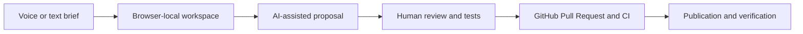

# CLARYEL Web Community user guides

- Repository: `claryel-company/claryel-web-community`
- Guide owner: Community Product and Operations Owner
- Structural validation: `2026-08-02`
- Status: `needs-live-scenario-validation`

## Purpose

Use the public voice-first Community workflow to turn a bounded website brief into a browser-local project, review proposed AI-assisted changes, publish through a GitHub Pull Request and verify the resulting site.

## Roles

| Role | Goal |
|---|---|
| Administrator | Configure approved identity, repository, publication and revocation boundaries |
| Operator or maintainer | Review generated work, run validation, manage Pull Requests and verify publication |
| Designer or content creator | Prepare the brief, structure, copy, media and accessibility requirements |
| End user | Create a simple website without understanding the complete delivery infrastructure |

## Simplest successful path

1. Start a new browser-local workspace and describe one bounded website goal.
2. Review the generated structure, copy, media references and accessibility requirements before repository publication.
3. Use the governed GitHub workflow to create a branch or Pull Request; never publish credentials or private source material.
4. Run build, link, responsive, keyboard and browser checks.
5. Merge only after review and verify the published site from an independent browser session.

Expected result: the user receives a working public site through an auditable branch, Pull Request, CI and publication path.

## Visual map

## Subscription-backed AI

ChatGPT, Codex, Claude, Claude Code, Gemini, Grok, Perplexity and Qwen Coder may support public research, information architecture, copy, design concepts, accessibility review, tests and proposed code through their official subscription surfaces. They receive only sanitised active-repository material, remain advisory and never receive production secrets, unrestricted customer data, merge authority or deployment authority. See `claryel-platform` ADR-0033.

## Administrator path

1. Approve the identity, repository, branch protection and publication target.
2. Grant the minimum GitHub and content permissions required by the workflow.
3. Keep subscription login, cookies, MFA secrets, repository credentials and deployment tokens outside project content and browser-local exports.
4. Define revocation and rollback to the last known-good publication.
5. Verify that repositories outside the active scope never enter prompts, uploads, search or retained output.

## Operator path

1. Confirm the active repository and exact user goal.
2. Review generated files, dependencies, licences and external links.
3. Run local or CI validation before merge.
4. Preserve evidence without secrets or personal data.
5. Verify the production URL and use a focused rollback when validation fails.

## Designer and content path

1. Define audience, purpose, hierarchy, tone and required calls to action.
2. Provide useful alternative text, meaningful headings and keyboard-accessible controls.
3. Review generated media for rights, privacy and factual accuracy.
4. Test mobile layouts and a low-motion or simpler alternative when motion or 3D is used.

## End-user path

1. Describe the site you need in ordinary language.
2. Check the visible page list, text and images before publishing.
3. Correct any private, incorrect or unwanted material.
4. Publish only through the visible governed GitHub workflow.
5. Open the final site and confirm that its main task works on a phone and desktop browser.

## Common problems

| Symptom | Safe action |
|---|---|
| Generated content contains private or incorrect information | Remove it before repository publication and revalidate the complete output |
| GitHub authentication is required | Use only the official account sign-in; never paste credentials into the brief or generated files |
| Build or CI fails | Keep the Pull Request unmerged, inspect the failure and apply a reviewed correction |
| Published site is not visible | Verify the deployment revision, target URL and cache from an independent session |
| AI subscription is unavailable or quota-limited | Mark the advisory channel degraded and continue with a local or approved alternative path |

## Accessibility and localisation

The workflow and generated sites must support keyboard navigation, visible focus, meaningful status and error text, useful alternative text, understandable language and explicit locale ownership. A novice user must be able to complete the main path without undocumented assistance.

## Scenario validation

| Scenario | State | Required evidence |
|---|---|---|
| First website from a bounded brief | Live test pending | Browser-local workspace, Pull Request, CI and final URL |
| Mobile and desktop completion | Live test pending | Dated screenshots and completed primary task |
| Keyboard and screen-reader path | Live test pending | Accessible completion evidence |
| Subscription provider failure | Live test pending | Visible degraded state and successful fallback |
| Rollback | Live test pending | Previous publication restored and verified |
| Novice user workflow | Usability test pending | Completion without undocumented help |

## Technical references

- Central architecture and active-only scope: `claryel-company/claryel-platform`
- Subscription workbench: ADR-0033
- Public repository language policy: ADR-0024
- Repository rules: `AGENTS.md`
- Current work: `NEXT_STEPS.md`

Review this guide after any workspace, identity, GitHub, provider, generated-content, accessibility, publication or rollback change.
